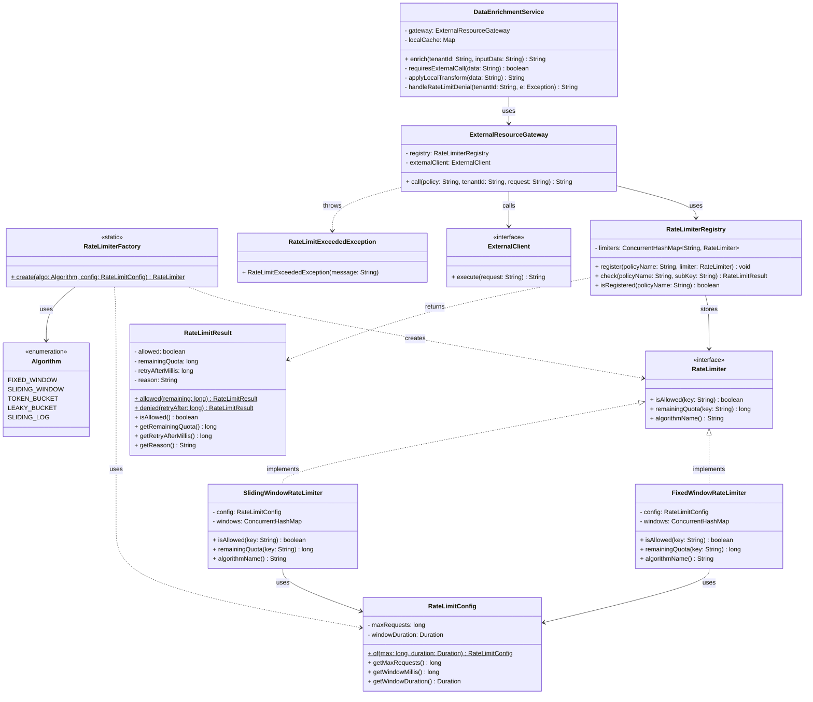

# Pluggable Rate Limiting System

A backend rate limiting module that controls access to paid external resources. Rate limiting is applied **only at the point of external call** — not on every incoming API request.

---

## Table of Contents

- [Overview](#overview)
- [Class Diagram](#class-diagram)
- [Package Structure](#package-structure)
- [Classes & Interfaces](#classes--interfaces)
  - [RateLimiter (interface)](#ratelimiter-interface)
  - [FixedWindowRateLimiter](#fixedwindowratelimiter)
  - [SlidingWindowRateLimiter](#slidingwindowratelimiter)
  - [RateLimitConfig](#ratelimitconfig)
  - [RateLimitResult](#ratelimitresult)
  - [RateLimiterFactory](#ratelimiterfactory)
  - [RateLimiterRegistry](#ratelimiterregistry)
  - [ExternalResourceGateway](#externalresourcegateway)
  - [ExternalClient (interface)](#externalclient-interface)
  - [DataEnrichmentService](#dataenrichmentservice)
- [Design Patterns Used](#design-patterns-used)
- [Algorithm Trade-offs](#algorithm-trade-offs)
- [Usage Example](#usage-example)

---

## Overview

```
Client API Request
      │
      ▼
DataEnrichmentService   ← business logic runs first
      │
      │  only if external call is needed
      ▼
ExternalResourceGateway ← single choke-point
      │
      ▼
RateLimiterRegistry     ← looks up policy by name
      │
      ▼
RateLimiter             ← algorithm decides allow/deny
      │
      ▼
ExternalClient          ← paid external API
```

---

## Class Diagram



> **Render this diagram** in any Mermaid-compatible viewer: GitHub, GitLab, VS Code (Markdown Preview Mermaid Support), or [mermaid.live](https://mermaid.live).

---

## Package Structure

```
ratelimiter/
├── core/
│   ├── RateLimiter.java               ← strategy interface
│   ├── RateLimitConfig.java           ← immutable config value object
│   └── RateLimitResult.java           ← rich allow/deny result
├── algorithms/
│   ├── FixedWindowRateLimiter.java    ← O(1) space, window resets
│   ├── SlidingWindowRateLimiter.java  ← O(n) space, no boundary burst
│   └── FutureAlgorithmStubs.java      ← Token Bucket, Leaky Bucket, Sliding Log
├── factory/
│   └── RateLimiterFactory.java        ← factory + Algorithm enum
├── registry/
│   └── RateLimiterRegistry.java       ← named policy store
├── gateway/
│   ├── ExternalResourceGateway.java   ← enforcement choke-point
│   └── ExternalClient.java            ← client interface + exception
├── service/
│   └── DataEnrichmentService.java     ← example internal service
├── tests/
│   └── RateLimiterTests.java          ← unit + concurrency tests
└── AppWiring.java                     ← wiring and algorithm switch demo
```

---

## Classes & Interfaces

### `RateLimiter` (interface)
**Package:** `ratelimiter.core`

The Strategy interface. All algorithms implement this. Internal services never reference a concrete class — only this interface.

| Modifier | Method | Returns | Description |
|----------|--------|---------|-------------|
| `+` | `isAllowed(key: String)` | `boolean` | Core check — allow or deny this call |
| `+` | `remainingQuota(key: String)` | `long` | Remaining calls in the current window |
| `+` | `algorithmName()` | `String` | Name for logging and monitoring |

---

### `FixedWindowRateLimiter`
**Package:** `ratelimiter.algorithms` · **Implements:** `RateLimiter`

Divides time into fixed windows. Counter resets at the start of each window.

| Modifier | Field / Method | Type | Description |
|----------|---------------|------|-------------|
| `−` | `config` | `RateLimitConfig` | Max requests and window size |
| `−` | `windows` | `ConcurrentHashMap<String, WindowState>` | Per-key counters |
| `+` | `isAllowed(key)` | `boolean` | Increments counter; denies if at limit |
| `+` | `remainingQuota(key)` | `long` | `maxRequests − current count` |
| `+` | `algorithmName()` | `String` | Returns `"FixedWindowCounter"` |

> **Trade-off:** O(1) time and space. Susceptible to boundary burst (2× quota possible at window edge).

---

### `SlidingWindowRateLimiter`
**Package:** `ratelimiter.algorithms` · **Implements:** `RateLimiter`

Stores a timestamp queue per key. The window slides with real time — no hard resets.

| Modifier | Field / Method | Type | Description |
|----------|---------------|------|-------------|
| `−` | `config` | `RateLimitConfig` | Max requests and window size |
| `−` | `windows` | `ConcurrentHashMap<String, TimestampWindow>` | Per-key timestamp deques |
| `+` | `isAllowed(key)` | `boolean` | Evicts old timestamps; denies if queue full |
| `+` | `remainingQuota(key)` | `long` | `maxRequests − queue size` |
| `+` | `algorithmName()` | `String` | Returns `"SlidingWindowCounter"` |

> **Trade-off:** Accurate rolling window, eliminates boundary burst. O(maxRequests) space per key.

---

### `RateLimitConfig`
**Package:** `ratelimiter.core`

Immutable value object. Created via static factory `of()`.

| Modifier | Field / Method | Type | Description |
|----------|---------------|------|-------------|
| `−` | `maxRequests` | `long` | Maximum calls allowed per window |
| `−` | `windowDuration` | `Duration` | Length of the window |
| `+` `static` | `of(max, duration)` | `RateLimitConfig` | Factory method |
| `+` | `getMaxRequests()` | `long` | — |
| `+` | `getWindowDuration()` | `Duration` | — |
| `+` | `getWindowMillis()` | `long` | Duration in milliseconds |

**Example:**
```java
RateLimitConfig.of(100, Duration.ofMinutes(1));   // 100 req/min
RateLimitConfig.of(1000, Duration.ofHours(1));    // 1000 req/hr
```

---

### `RateLimitResult`
**Package:** `ratelimiter.core`

Rich result returned from `RateLimiterRegistry.check()`. Carries enough metadata to build `X-RateLimit-*` headers without extra calls.

| Modifier | Field / Method | Type | Description |
|----------|---------------|------|-------------|
| `−` | `allowed` | `boolean` | Decision |
| `−` | `remainingQuota` | `long` | Calls left in window |
| `−` | `retryAfterMillis` | `long` | Wait time before retrying (0 if allowed) |
| `−` | `reason` | `String` | Human-readable denial reason |
| `+` `static` | `allowed(remaining)` | `RateLimitResult` | Factory — allowed path |
| `+` `static` | `denied(retryAfter)` | `RateLimitResult` | Factory — denied path |
| `+` | `isAllowed()` | `boolean` | — |
| `+` | `getRemainingQuota()` | `long` | — |
| `+` | `getRetryAfterMillis()` | `long` | — |
| `+` | `getReason()` | `String` | — |

---

### `RateLimiterFactory`
**Package:** `ratelimiter.factory`

Maps an `Algorithm` enum to a concrete `RateLimiter` instance. Adding a new algorithm requires only a new class and one new `case` here — no other code changes (Open/Closed Principle).

| Modifier | Method | Returns | Description |
|----------|--------|---------|-------------|
| `+` `static` | `create(algo, config)` | `RateLimiter` | Instantiates the chosen algorithm |

**`Algorithm` enum values:**

| Value | Status |
|-------|--------|
| `FIXED_WINDOW` | Implemented |
| `SLIDING_WINDOW` | Implemented |
| `TOKEN_BUCKET` | Stub — future |
| `LEAKY_BUCKET` | Stub — future |
| `SLIDING_LOG` | Stub — future |

---

### `RateLimiterRegistry`
**Package:** `ratelimiter.registry`

Holds one named `RateLimiter` per policy. Builds a composite key (`policyName:subKey`) so different tenants and different policies each get independent quota buckets.

| Modifier | Field / Method | Type | Description |
|----------|---------------|------|-------------|
| `−` | `limiters` | `ConcurrentHashMap<String, RateLimiter>` | Policy map |
| `+` | `register(policyName, limiter)` | `void` | Adds a policy |
| `+` | `check(policyName, subKey)` | `RateLimitResult` | Checks quota for `policyName:subKey` |
| `+` | `isRegistered(policyName)` | `boolean` | Guard for missing policy |

**Composite key logic:**
```
compositeKey = "openai:T1"   → tenant T1's OpenAI quota
compositeKey = "stripe:T1"   → tenant T1's Stripe quota  (independent)
compositeKey = "openai:T2"   → tenant T2's OpenAI quota  (independent)
```

---

### `ExternalResourceGateway`
**Package:** `ratelimiter.gateway`

The single enforcement point. Internal services call `call()` here instead of invoking `ExternalClient` directly.

| Modifier | Field / Method | Type | Description |
|----------|---------------|------|-------------|
| `−` | `registry` | `RateLimiterRegistry` | Injected registry |
| `−` | `externalClient` | `ExternalClient` | Injected client |
| `+` | `call(policy, tenantId, request)` | `String` | Checks quota, then calls external or throws |

**Flow inside `call()`:**
```
1. registry.check(policy, tenantId)
2. if denied  → throw RateLimitExceededException
3. if allowed → externalClient.execute(request)
```

---

### `ExternalClient` (interface)
**Package:** `ratelimiter.gateway`

Abstraction over the real HTTP/SDK client. Inject a mock in tests; inject the real implementation in production.

| Modifier | Method | Returns | Description |
|----------|--------|---------|-------------|
| `+` | `execute(request: String)` | `String` | Makes the actual external call |

---

### `DataEnrichmentService`
**Package:** `ratelimiter.service`

Example internal service. Demonstrates that **rate limiting is only triggered when business logic decides an external call is needed**.

| Modifier | Field / Method | Type | Description |
|----------|---------------|------|-------------|
| `−` | `gateway` | `ExternalResourceGateway` | Injected gateway |
| `−` | `localCache` | `Map<String, String>` | In-memory cache |
| `+` | `enrich(tenantId, inputData)` | `String` | Main entry point |
| `−` | `requiresExternalCall(data)` | `boolean` | Business rule — decides if external call needed |
| `−` | `applyLocalTransform(data)` | `String` | Local-only processing path |
| `−` | `handleRateLimitDenial(tenantId, e)` | `String` | Graceful degradation |

**Decision flow:**
```
enrich()
  ├── cache hit?         → return cached (no quota consumed)
  ├── needs external?    → NO  → applyLocalTransform (no quota consumed)
  └── needs external?    → YES → gateway.call()
                                    ├── allowed → return result
                                    └── denied  → handleRateLimitDenial
```

---

## Design Patterns Used

| Pattern | Where | Why |
|---------|-------|-----|
| **Strategy** | `RateLimiter` interface + algorithm classes | Swap algorithms without changing callers |
| **Factory** | `RateLimiterFactory` | Decouple instantiation from usage |
| **Facade** | `ExternalResourceGateway` | Single choke-point; hides registry + client wiring |
| **Registry** | `RateLimiterRegistry` | Named lookup of policies at runtime |
| **Value Object** | `RateLimitConfig`, `RateLimitResult` | Immutable, safe to share across threads |

---

## Algorithm Trade-offs

| | Fixed Window | Sliding Window |
|---|---|---|
| **Space** | O(keys) | O(keys × maxRequests) |
| **Time per call** | O(1) | O(expired entries), amortized O(1) |
| **Boundary burst** | Yes — 2× burst at window edge | No — always accurate |
| **Best for** | High-throughput, approximate OK | Paid APIs where accuracy matters |

For a **paid external resource**, Sliding Window is the safer default. The boundary burst in Fixed Window can cause you to unknowingly send 2× your intended quota within a short span at the boundary.

---

## Usage Example

```java
// 1. Configure — 5 external calls per minute per tenant
RateLimitConfig config = RateLimitConfig.of(5, Duration.ofMinutes(1));

// 2. Choose algorithm — swap this one line to change behavior
RateLimiter limiter = RateLimiterFactory.create(Algorithm.SLIDING_WINDOW, config);

// 3. Register named policies
RateLimiterRegistry registry = new RateLimiterRegistry();
registry.register("openai", limiter);

// 4. Wire the gateway
ExternalClient realClient = request -> callOpenAI(request);
ExternalResourceGateway gateway = new ExternalResourceGateway(registry, realClient);

// 5. Use in your service
DataEnrichmentService service = new DataEnrichmentService(gateway);

String result = service.enrich("T1", "ENRICH:some-data");
// → calls external if needed, respects 5 req/min limit for T1
// → cache hits and local-only requests consume zero quota
```

**Switching algorithms** requires changing only line 2. No business logic, no service code, no registry code changes.

---

## Thread Safety

Both algorithm implementations use:
- `ConcurrentHashMap` for the outer key map (lock-free reads)
- `synchronized` on a per-key state object (minimal lock scope)

This avoids a global lock while remaining safe under concurrent access. Each tenant key is independently locked, so high-traffic keys don't block each other.
